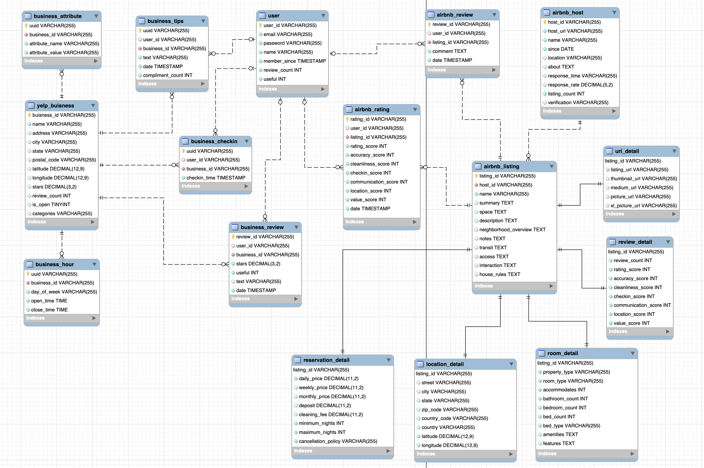

# Data Parser For CS5200 DBMS

## Summary

This repo is the utils to process raw data into valid csv format for database 
importing.

## DataSource

YelpDataSet (Json Format): https://www.yelp.com/dataset

AirbnbListing (CSV Format): https://public.opendatasoft.com/explore/dataset/airbnb-listings

## SQL Schema

## What It Does

- Process(select / replace 'null' / format correction) the raw Json data from 
YelpDataSet to individual csv file for loading into SQL database
- Process(split / insert missing quotes / format correction) the raw csv data from 
  AirbnbListing to individual csv file for loading into SQL database
  
## Usage

- Change corresponding input file path in relative class.

